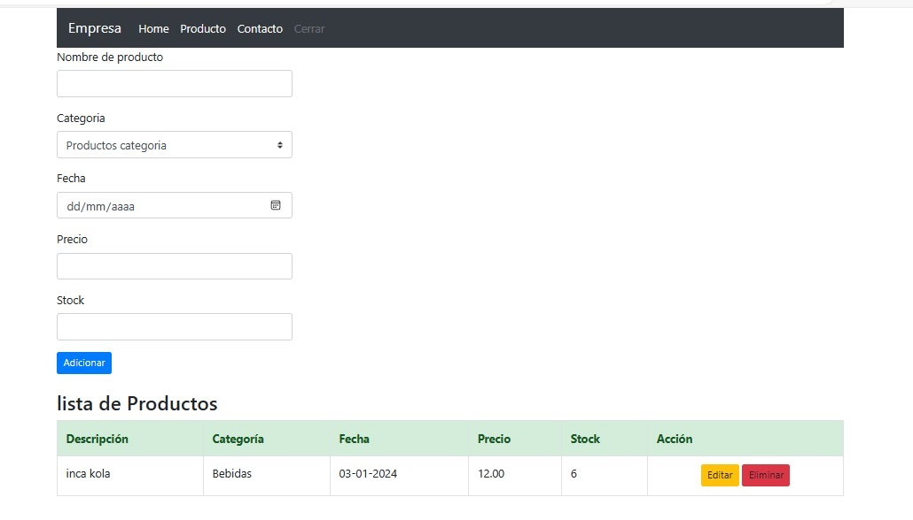
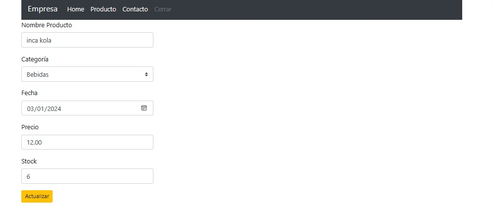
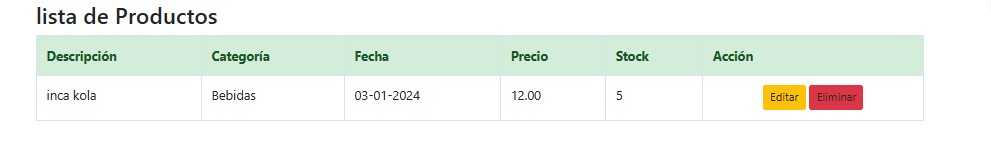

# PythonArtefactos

- este proyecto es para ingresar artículos de una tienda como bebidas, lácteos, limpieza, etc
- El proyecto se realizo netamente en PYTHON with DJANGO  

Ese es mi inicio en **PYTHYON** 

# Install

este proyecto  se necesita install '**_PYTHON_**'

## Comando para utilizar en "Django" se poner el comando 

- '_pip install django_'

## Para crear una "Proyecto" en PYTHON  
- Es con el comando "_django-admin startproject AppWebInicio_"

## Para crear una "Aplicación" en PYTHON  
- Es con el comanndo "_django-admin startapp app_"
  - Este comando se poner dentro de la carpeta "AppWebInicio"

## Para ejecutar este programa es con el
- comando "python manage.py runserver "

# Imagen de la Web

- 
- 
- 

